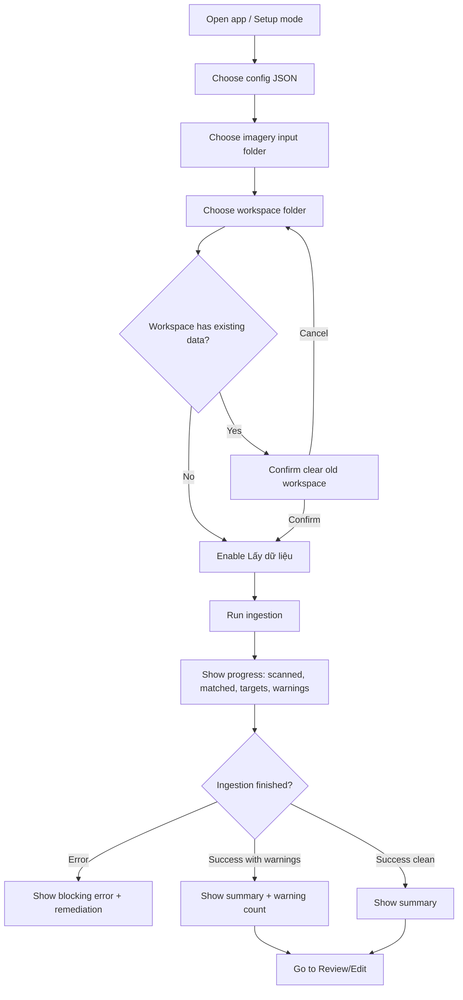
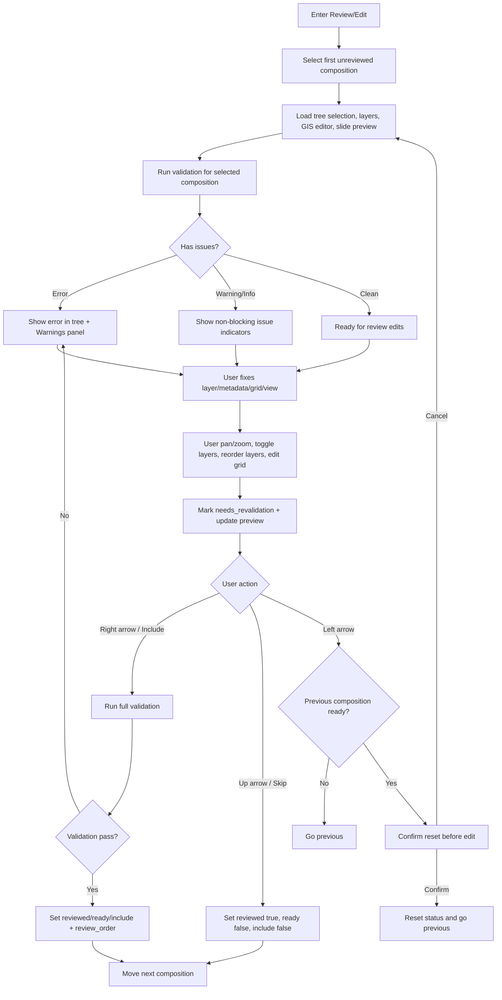
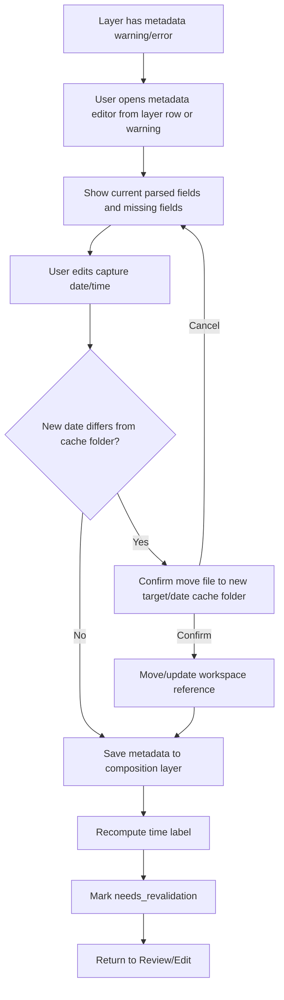
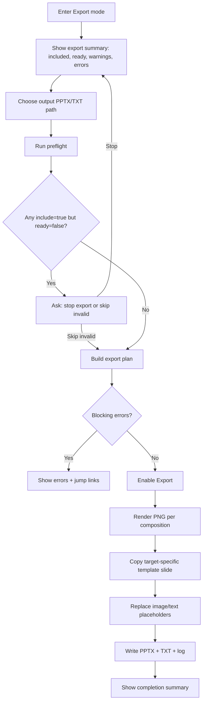

# UX Design Specification 3.ThucTheNgay

**Author:** Ongtu
**Date:** 2026-05-23

---

## Workflow Initialization

Input documents loaded:

- Product Brief: `_bmad-output/planning-artifacts/briefs/brief-3.ThucTheNgay-2026-05-23/brief.md`
- PRD: `_bmad-output/planning-artifacts/prds/prd-3.ThucTheNgay-2026-05-23/prd.md`

Key UX framing from inputs:

- Primary persona: `Operator báo cáo ảnh vệ tinh`.
- Main workflow modes: `Setup`, `Review/Edit`, `Export`.
- Core UX risk: app must preserve manual review control while reducing repetitive GIS/PowerPoint work.
- Most important screen: `Review/Edit`, where Operator evaluates each composition, edits layer/view/grid/metadata, sees preview/warnings, and marks ready/include/skip.

## Executive Summary

### Project Vision

App là một desktop workflow giúp Operator báo cáo ảnh vệ tinh chuyển bộ ảnh GeoTIFF thành báo cáo PowerPoint/TXT có kiểm soát. Giá trị chính không phải tự động hóa tuyệt đối, mà là giảm thao tác lặp trong khi vẫn cho người dùng duyệt từng composition trước khi xuất.

### Target Users

Người dùng chính là `Operator báo cáo ảnh vệ tinh`: quen với file local/LAN, GeoTIFF, PowerPoint template và khái niệm tọa độ/grid; cần công cụ thực dụng, rõ trạng thái, ít nhiễu, ưu tiên kiểm soát và độ tin cậy.

### Key Design Challenges

- Review/Edit là màn hình nặng nhất: phải hiển thị tree composition, layer stack, warnings, slide preview và GIS editor mà không rối.
- App phải giúp người dùng hiểu trạng thái `reviewed`, `ready`, `include`, warning/error và `review_order` mà không cần đọc JSON.
- Editor phải hỗ trợ pan/zoom/layer/grid mượt với GeoTIFF lớn, trong khi preview vẫn đủ giống final export.
- Metadata lỗi và template lỗi cần được xử lý bằng remediation rõ ràng, không chỉ báo lỗi kỹ thuật.

### Design Opportunities

- Dùng workflow 3 mode `Setup -> Review/Edit -> Export` để người dùng luôn biết mình đang ở giai đoạn nào.
- Dùng tree + queue filter để vừa giữ cấu trúc target/date, vừa duyệt nhanh các composition chưa xử lý hoặc có lỗi.
- Biến validation thành một phần UX chính: icon/status tại chỗ, Warnings panel tổng hợp, và remediation tiếng Việt.
- Làm Review/Edit theo thao tác lặp nhanh: chọn composition, chỉnh, mũi tên phải để include, mũi tên lên để skip, mũi tên trái để quay lại.

## Core User Experience

### Defining Experience

Trải nghiệm cốt lõi là một review loop tốc độ cao cho từng composition. Operator báo cáo ảnh vệ tinh cần nhìn thấy composition hiện tại, hiểu ngay trạng thái kỹ thuật của nó, chỉnh nhanh layer/view/grid/metadata, rồi quyết định include hoặc skip bằng thao tác bàn phím/nút rõ ràng.

Core action quan trọng nhất là `review composition`: không chỉ xem ảnh, mà là xác nhận rằng composition đủ đúng để trở thành một slide báo cáo.

### Platform Strategy

MVP là desktop app dùng chuột và bàn phím. UX phải tận dụng:

- file picker native cho config/input/workspace/output;
- splitter resize được cho layout làm việc nhiều panel;
- keyboard navigation cho review loop;
- mouse wheel/pan cho GIS editor;
- local/LAN file workflow, không yêu cầu network.

App không cần touch-first. Thiết kế ưu tiên màn hình desktop rộng, thao tác lặp nhiều lần và khả năng scan trạng thái nhanh.

### Effortless Interactions

Các thao tác cần gần như không cần suy nghĩ:

- chọn composition tiếp theo cần duyệt;
- bật/tắt layer;
- đổi layer order;
- pan/zoom map dưới frame cố định;
- xem lỗi/warning liên quan đúng composition/layer;
- bấm mũi tên phải để include composition hợp lệ;
- bấm mũi tên lên để skip;
- quay lại composition trước khi cần chỉnh lại.

App nên tự động:

- tính time label từ layer visible hợp lệ;
- đánh dấu `needs_revalidation` khi state quan trọng đổi;
- cập nhật slide preview debounced;
- đưa issue/error vào đúng target/composition/layer;
- giữ review order theo thao tác duyệt.

### Critical Success Moments

- Sau ingest, Operator thấy danh sách target/composition rõ ràng và tin rằng app đã gom ảnh đúng.
- Trong Review/Edit, Operator chỉnh frame và thấy preview slide phản ánh đúng thứ sẽ export.
- Khi có lỗi metadata/template/layer, Operator hiểu lỗi và biết cách sửa.
- Khi bấm mũi tên phải, validation pass và composition được đưa vào queue export.
- Sau export, Operator thấy PPTX/TXT đúng số slide, đúng review order và có log rõ ràng.

### Experience Principles

- **Review-first:** mọi UI trong Review/Edit phải phục vụ quyết định include/skip composition.
- **Status is visible:** trạng thái ready/include/warning/error phải nhìn được ngay, không cần mở JSON.
- **Fast repeated action:** workflow phải tối ưu cho hàng chục composition liên tiếp.
- **Preview must be trustworthy:** preview không cần sắc nét như final, nhưng phải khớp tâm/scale view, layer và grid.
- **Errors need remediation:** lỗi kỹ thuật phải đi kèm cách sửa bằng tiếng Việt.
- **Workspace remains inspectable:** UI thao tác dễ, nhưng không che giấu artifact JSON/workspace.

## Desired Emotional Response

### Primary Emotional Goals

Mục tiêu cảm xúc chính là `confident control`: Operator cảm thấy mình kiểm soát toàn bộ quá trình từ dữ liệu ảnh đến slide báo cáo, và có thể tin rằng app không âm thầm làm sai.

Cảm giác cần tạo ra:

- bình tĩnh khi xử lý nhiều target/composition;
- tin tưởng vì trạng thái và lỗi được hiển thị rõ;
- hiệu quả vì thao tác lặp được rút gọn;
- chắc chắn vì preview phản ánh đúng final export;
- không bị mắc kẹt vì lỗi luôn có remediation.

### Emotional Journey Mapping

- **Setup:** Operator cần cảm thấy an toàn. Trước khi xóa workspace cũ, app phải hỏi rõ. Trong lúc ingest, progress phải đủ chi tiết để người dùng biết app đang làm gì.
- **Review/Edit:** Operator cần cảm thấy tập trung và kiểm soát. Màn hình không nên quá trang trí; mọi panel phải phục vụ quyết định include/skip.
- **Khi có lỗi:** Operator không nên cảm thấy bị đổ lỗi hoặc mù mờ. Issue phải nói rõ lỗi ở target/composition/layer nào và sửa thế nào.
- **Khi duyệt thành công:** Operator cần cảm thấy nhịp làm việc trôi chảy: validate pass, review_order được gán, chuyển composition tiếp theo.
- **Export:** Operator cần cảm thấy chắc chắn: preflight rõ ràng, output path rõ, summary/log đầy đủ.

### Micro-Emotions

UX cần ưu tiên:

- **Confidence over confusion:** status, issue và next action luôn rõ.
- **Trust over skepticism:** preview, validation và export log phải nhất quán.
- **Focus over distraction:** giao diện dense nhưng trật tự, không dùng trang trí thừa.
- **Momentum over friction:** review loop bằng phím/nút phải nhanh.
- **Recoverability over anxiety:** các action reset/xóa/move file cần xác nhận và giải thích.

### Design Implications

- Status indicators phải nằm ngay trong target/composition tree và layer panel.
- Warnings panel cần aggregate nhưng vẫn điều hướng được tới item liên quan.
- Error message dùng tiếng Việt, có remediation cụ thể.
- Nút/phím review cần nhất quán: phải = include nếu valid, lên = skip, trái = quay lại.
- Dangerous actions như xóa workspace, reset ready composition, move file do sửa date phải dùng confirm dialog rõ hậu quả.
- Export completion phải hiển thị summary và log path để tạo cảm giác có bằng chứng.

### Emotional Design Principles

- **No silent failure:** app không được âm thầm bỏ qua lỗi quan trọng.
- **No mystery state:** mọi trạng thái ảnh hưởng export phải nhìn được trong UI.
- **Calm density:** màn hình có nhiều thông tin nhưng phân cấp rõ, không gây nhiễu.
- **Validate before commitment:** các bước đưa vào báo cáo phải có validation trước.
- **Proof after action:** ingest/export/review action quan trọng phải để lại summary, status hoặc log.

## UX Pattern Analysis & Inspiration

### Inspiring Products Analysis

**QGIS** là nguồn cảm hứng cho GIS interaction: layer list, map canvas, pan/zoom, coordinate/grid thinking và khả năng inspect trạng thái dữ liệu. Pattern cần học là tách rõ canvas chính khỏi panel điều khiển, cho layer visibility/order trực quan, và không giấu lỗi dữ liệu. Pattern không nên copy là độ phức tạp quá rộng của GIS đầy đủ; MVP chỉ cần GIS mini phục vụ report workflow.

**Adobe Lightroom / Capture One** là nguồn cảm hứng cho review queue: người dùng xử lý nhiều item tương tự nhau, chỉnh từng item, đánh dấu chọn/bỏ qua, rồi xuất batch. Pattern cần học là loop nhanh, trạng thái từng item rõ, preview lớn ở trung tâm, metadata/adjustments ở panel phụ. Với app này, composition giống một ảnh trong queue: cần xem, chỉnh, include/skip, chuyển tiếp.

**VS Code / JetBrains IDEs** là nguồn cảm hứng cho dense desktop UI có tree, editor chính, side panels và Problems/Warnings panel. Pattern cần học là status/error xuất hiện ở đúng nơi, panel tổng hợp có thể điều hướng về item liên quan, và layout splitter giúp người dùng tùy chỉnh không gian làm việc.

### Transferable UX Patterns

- **Layer panel + map canvas từ QGIS:** dùng cho layers panel và GIS editor, nhưng thu gọn chỉ còn visibility, order, metadata status và layer actions cần thiết.
- **Review queue từ Lightroom:** dùng cho composition navigation, keyboard workflow và include/skip state.
- **Problems panel từ IDE:** dùng cho Warnings panel aggregate, có issue severity, remediation và navigation tới target/composition/layer.
- **Workspace modes từ creative/pro tools:** Setup, Review/Edit, Export là các mode rõ ràng, giúp Operator biết đang ở giai đoạn nào.
- **Inspector-style side panels:** layer/grid/metadata controls nằm cạnh preview/editor, không nằm trong modal quá thường xuyên.

### Anti-Patterns to Avoid

- **Full GIS overload:** quá nhiều tool GIS, toolbar dày đặc, layer styling phức tạp hoặc CRS controls lộ ra quá sớm sẽ làm app lệch khỏi report workflow.
- **Hidden batch automation:** tự động include/export mà không cho review rõ sẽ phá cảm giác kiểm soát.
- **Modal-heavy editing:** nếu metadata/grid/layer chỉnh sửa đều mở modal, review loop sẽ chậm.
- **Ambiguous status colors:** chỉ dùng màu mà không có icon/text/tooltip sẽ khó hiểu khi có nhiều trạng thái.
- **Preview không đáng tin:** nếu preview thường xuyên khác final export về tâm/scale view, grid hoặc layer, người dùng sẽ quay lại kiểm tra thủ công trong PowerPoint.
- **Warnings detached from context:** panel cảnh báo chỉ liệt kê text nhưng không jump được tới composition/layer liên quan sẽ gây mất thời gian.

### Design Inspiration Strategy

Adopt:

- Tree + canvas + side panels từ GIS/IDE desktop tools.
- Review queue và keyboard progression từ photo review tools.
- Problems/Warnings panel có navigation từ IDEs.

Adapt:

- Layer management chỉ giữ các controls cần cho report: visibility, order, metadata status, cloud percent, capture time.
- GIS editor chỉ expose pan/zoom/grid/frame; không expose cartographic/GIS tools ngoài MVP.
- Preview dùng slide mental model của PowerPoint nhưng không biến app thành slide editor.

Avoid:

- Biến app thành QGIS nhỏ với quá nhiều controls.
- Biến app thành PowerPoint clone.
- Làm workflow quá wizard-like trong Review/Edit khiến thao tác lặp bị chậm.

## Design System Foundation

### Design System Choice

MVP dùng hướng **Hybrid Qt-native + design tokens**. App dựa trên Qt Widgets/PySide6 native components để giữ tốc độ phát triển, ổn định desktop và hành vi quen thuộc. Trên nền đó, UX spec định nghĩa design tokens và component conventions cho các phần quan trọng: status, warnings, layer rows, composition tree, toolbar actions, GIS overlay và export/preflight summary.

### Rationale for Selection

- App là desktop productivity/internal tool, không cần visual uniqueness như consumer brand.
- PySide6 native widgets phù hợp file picker, splitter, tree, table/list, toolbar, dialogs và keyboard workflow.
- Review/Edit là màn hình dense; cần consistency về spacing, typography, status colors và icon semantics để tránh rối.
- Custom toàn bộ UI bằng QSS sẽ tốn thời gian và dễ làm chậm MVP.
- Chỉ custom nơi tạo giá trị UX thật: status indicators, warning severity, layer controls, preview/frame overlay và navigation actions.

### Implementation Approach

- Sử dụng Qt native widgets làm default: `QMainWindow`, `QSplitter`, `QTreeView`, `QListView/QTableView`, `QToolBar`, `QDockWidget` hoặc panel widgets, dialogs native.
- Định nghĩa design tokens ở một module/theme riêng để code dùng nhất quán.
- Áp dụng QSS nhẹ ở cấp app và component quan trọng, tránh override sâu mọi widget.
- Icon dùng một bộ thống nhất, ưu tiên biểu tượng quen thuộc cho folder, refresh/ingest, warning/error/info, visible/hidden layer, move up/down, validate, export.
- Tooltip bắt buộc cho icon-only actions không hiển nhiên.

### Customization Strategy

Design tokens tối thiểu:

- **Spacing:** compact desktop density; rows vừa đủ đọc nhưng không chiếm quá nhiều chiều cao.
- **Typography:** system font; heading nhỏ, label rõ, không dùng hero-scale type.
- **Status colors:** error, warning, info, ready/include/skipped/needs-review phải nhất quán và không chỉ dựa vào màu.
- **Panels:** borders/subtle separators rõ nhưng không biến mọi khu thành card trang trí.
- **GIS overlay:** map frame, grid labels, selection/frame indicators cần rõ trên ảnh vệ tinh nhiều nền màu.
- **Danger actions:** confirm dialogs có title/hậu quả/action rõ ràng cho clear workspace, reset ready composition, move file do metadata date đổi.

## 2. Core User Experience

### 2.1 Defining Experience

Defining experience của app là: **review một composition và quyết định nó có trở thành slide báo cáo hay không**.

Câu mô tả ngắn: `Duyệt từng phiên ảnh như một hàng đợi, chỉnh khung/layer/grid ngay trên preview GIS, rồi bấm một phím để include hoặc skip.`

Nếu interaction này đúng, toàn bộ sản phẩm sẽ có giá trị. Operator không cần nghĩ về JSON, render pipeline hay template internals; họ chỉ cần thấy composition, chỉnh nó đến khi đáng tin, rồi đưa vào hoặc bỏ khỏi báo cáo.

### 2.2 User Mental Model

Operator mang vào app ba mental model quen thuộc:

- **PowerPoint slide:** mỗi composition cuối cùng sẽ thành một slide.
- **GIS map frame:** ảnh nằm dưới một khung bản đồ cố định, pan/zoom để chọn vùng export.
- **Review queue:** có nhiều item cần duyệt liên tiếp, mỗi item có thể include hoặc skip.

UX cần kết hợp ba mental model này mà không để chúng xung đột. App không phải PowerPoint editor đầy đủ, không phải GIS đầy đủ, và cũng không phải batch processor ẩn. Nó là một review workstation cho slide bản đồ.

### 2.3 Success Criteria

Core experience thành công khi:

- Operator hiểu ngay composition hiện tại thuộc target/ngày nào.
- Operator thấy layer nào đang bật, thứ tự layer, timestamp/cloud/status.
- Operator chỉnh pan/zoom mà không bị mất định hướng.
- Operator tin slide preview đủ gần với final export.
- Operator biết chính xác vì sao composition chưa ready nếu validation fail.
- Operator có thể duyệt nhiều composition liên tiếp bằng nhịp thao tác ổn định.
- Operator có thể quay lại composition trước mà không vô tình phá review state.

### 2.4 Novel UX Patterns

App chủ yếu kết hợp các pattern quen thuộc thay vì phát minh interaction mới:

- Tree/list review queue từ photo tools.
- Layer panel + map canvas từ GIS.
- Problems/Warnings panel từ IDE.
- Slide preview từ PowerPoint.

Điểm mới là tổ hợp này xoay quanh `composition`: một target-date unit vừa là ảnh/layer stack, vừa là map frame, vừa là slide tương lai. UX cần dạy khái niệm này bằng label UI như `Phiên ảnh` hoặc `Slide mục tiêu`, không dùng thuật ngữ kỹ thuật quá sớm.

### 2.5 Experience Mechanics

**Initiation**

- Operator vào Review/Edit sau khi ingest xong.
- App chọn composition đầu tiên `Chưa duyệt`.
- Tree bên trái highlight target/composition hiện tại.
- Editor load layer stack, view center/scale, grid và preview.

**Interaction**

- Operator bật/tắt layer trong layer panel.
- Operator đổi layer order bằng nút/icon hoặc drag nếu implement được ổn định.
- Operator pan/zoom trong GIS editor; map frame giữ cố định.
- Operator chỉnh grid interval nếu cần.
- Operator sửa metadata từ layer panel khi có warning/error.
- Slide preview cập nhật debounce/two-stage.

**Feedback**

- Tree hiển thị status/issue severity.
- Layer row hiển thị visible/order/capture time/cloud/metadata status.
- Warnings panel hiển thị issue và remediation.
- Preview cho thấy bố cục slide hiện tại.
- Khi state đổi, UI đánh dấu `needs_revalidation`.

**Completion**

- Mũi tên phải: validate; nếu pass thì set `reviewed=true`, `ready=true`, `include=true`, gán review_order, chuyển composition tiếp theo.
- Mũi tên lên: mark reviewed + skip, chuyển composition tiếp theo.
- Mũi tên trái: quay lại composition trước; nếu composition đó ready thì hỏi trước khi reset để chỉnh lại.
- Khi hết queue, app gợi ý chuyển sang Export mode.

## Visual Design Foundation

### Color System

Không dùng palette marketing hoặc màu quá nổi. App nên có visual tone của desktop productivity tool: trung tính, rõ trạng thái, tương phản tốt trên ảnh vệ tinh.

Đề xuất:

- **Base:** light neutral Qt-native theme, nền xám rất nhạt / trắng ngà nhẹ cho panel.
- **Canvas area:** nền tối hoặc neutral deep gray để ảnh vệ tinh và map frame nổi rõ.
- **Primary action:** xanh dương hoặc teal vừa phải cho action chính như `Lấy dữ liệu`, `Validate`, `Export`.
- **Status colors:**
  - Error: đỏ rõ, dùng cho trạng thái chặn ready/export.
  - Warning: amber/vàng cam, dùng cho vấn đề cần chú ý.
  - Info: xanh lam/xám xanh.
  - Ready/Include: xanh lá vừa phải.
  - Skipped: xám.
  - Needs review/revalidation: tím/xanh tím nhẹ hoặc badge neutral có icon, tránh nhầm với error.
- Không chỉ dùng màu: mọi status cần icon/text/tooltip.

### Typography System

- Dùng system font của OS/Qt để giữ desktop-native feel.
- Font size ưu tiên đọc nhanh trong UI dense:
  - Section title: 14-16px.
  - Panel label/table header: 12-13px.
  - Body/list row: 12-13px.
  - Metadata/detail text: 11-12px.
- Không dùng heading lớn trong tool surface.
- Monospace chỉ dùng cho path, IDs, timestamps, issue_id hoặc debug-style values.

### Spacing & Layout Foundation

- Dùng compact 4px/8px spacing scale.
- Row height ổn định cho tree/layer list để scan nhanh.
- Không dùng card lồng card. Panel dùng splitter, border/separator nhẹ.
- Review/Edit ưu tiên density: nhiều thông tin nhưng phân cấp rõ.
- Setup/Export có thể thoáng hơn một chút vì ít thao tác lặp.

### Accessibility Considerations

- Status không phụ thuộc màu duy nhất.
- Contrast đủ rõ cho text nhỏ trong panel.
- Icon-only buttons cần tooltip.
- Keyboard navigation là requirement chính, không chỉ convenience.
- Dialog nguy hiểm phải có nội dung hậu quả rõ và button label cụ thể.

## Design Direction Decision

### Design Directions Explored

Đã explore 6 hướng trong `ux-design-directions.html`: workstation cân bằng, inspector bên phải, canvas-first overlay, GIS-heavy three-pane, photo-review filmstrip, và export/preflight dashboard.

### Chosen Direction

Chọn `Direction 1 - Workstation cân bằng` làm hướng chính cho Review/Edit. Dùng `Direction 6 - Export/preflight dashboard` làm pattern cho Export mode.

### Design Rationale

Direction 1 phù hợp nhất với core experience:

- giữ tree composition, layer panel và slide preview trong vùng trái;
- giữ GIS editor là vùng làm việc chính;
- warnings nằm gần nhưng không lấn canvas;
- dễ implement bằng Qt splitters;
- hỗ trợ review loop nhanh;
- không biến app thành GIS đầy đủ hoặc PowerPoint clone.

Direction 6 phù hợp với Export mode vì preflight/export cần summary số liệu, issue summary và export plan rõ ràng hơn là canvas editing.

### Implementation Approach

Review/Edit layout:

- top toolbar/mode tabs;
- left splitter khoảng 25%: composition tree, layers, slide preview;
- right main GIS editor khoảng 75%;
- bottom hoặc docked Warnings panel;
- keyboard review actions luôn visible trong toolbar.

Export layout:

- top controls: preflight, output path, export;
- summary metrics: slide count, target count, skipped, warnings, errors;
- export plan list;
- completion summary/log paths.

## User Journey Flows

### UJ-1: Lấy dữ liệu từ bộ ảnh mới

UX requirements:

- File paths phải hiển thị rõ, có browse button.
- Clear workspace là destructive action, cần confirm dialog.
- Progress không chỉ là progress bar; phải có counters.
- Sau ingest, action chính là `Review/Edit`.

### UJ-2: Duyệt và chỉnh composition

UX requirements:

- Current composition identity phải luôn visible.
- Review actions phải có button + keyboard shortcut.
- Nếu validation fail, không chuyển composition.
- Warnings panel phải jump được tới item liên quan.
- Preview update không được làm giật pan/zoom.

### UJ-3: Sửa metadata ảnh không parse được

UX requirements:

- Metadata editor nên là inline panel hoặc small dialog, không làm người dùng mất context.
- Date/time input phải rõ format.
- Nếu move file, confirm dialog phải nói rõ old path/new path hoặc target/date mới.
- Sau save, app cần chỉ ra composition đã cần validate lại.

### UJ-4: Export báo cáo

UX requirements:

- Export mode dùng dashboard summary, không dùng editor layout.
- Preflight phải chạy lại validation cho included compositions.
- Export plan cần hiển thị slide order.
- Completion summary phải có output paths và log path.

### Journey Patterns

- **Mode progression:** Setup -> Review/Edit -> Export.
- **Validate before commitment:** include/export đều validate trước.
- **Issue to object navigation:** issue luôn link tới target/composition/layer.
- **Confirm destructive changes:** clear workspace, reset ready composition, move file.
- **Proof after action:** ingest summary, review status, export log.

### Flow Optimization Principles

- Action chính mỗi mode chỉ nên có một nút nổi bật.
- Review/Edit phải tối ưu cho repeated keyboard loop.
- Lỗi chặn phải xuất hiện tại chỗ và trong Warnings panel.
- Long-running tasks phải có progress + counters + cancel nếu feasible.
- Sau mỗi flow hoàn tất, app nên gợi ý next mode/action.

## Component Strategy

### Design System Components

Dùng Qt-native components làm foundation:

- `QMainWindow` cho app shell.
- `QTabBar` hoặc segmented mode switch cho `Setup / Review/Edit / Export`.
- `QToolBar` cho action chính và keyboard action mirror.
- `QSplitter` cho resizable panels.
- `QTreeView` cho target/composition tree.
- `QListView` hoặc `QTableView` cho layer list và export plan.
- `QGraphicsView` cho GIS editor.
- `QLabel`/custom image widget cho slide preview.
- `QProgressBar` + labels/counters cho ingestion/export progress.
- `QDialog`/`QMessageBox` cho destructive confirmations.
- `QDockWidget` hoặc bottom panel cho Warnings.

### Custom Components

#### Mode Switcher

**Purpose:** Chuyển giữa Setup, Review/Edit, Export.  
**States:** active, disabled, has-warning, has-error.  
**Behavior:** Review/Edit disabled nếu chưa có workspace/composition; Export disabled hoặc warning nếu chưa có composition included.  
**Accessibility:** keyboard focusable, tooltip mô tả trạng thái disabled.

#### Path Picker Row

**Purpose:** Chọn config/input/workspace/output path.  
**Anatomy:** label, read-only path field, browse button, validation indicator.  
**States:** empty, valid, invalid, warning.  
**Behavior:** path dài hiển thị elide giữa, tooltip full path.

#### Ingestion Progress Panel

**Purpose:** Hiển thị ingest đang làm gì.  
**Content:** scanned count, matched count, targets with images, warning count, current target, matched current target.  
**States:** idle, running, success, success_with_warnings, error.  
**Behavior:** progress log ngắn, không chỉ progress bar.

#### Composition Tree Item

**Purpose:** Hiển thị target/composition và trạng thái review/export.  
**Anatomy:** expand arrow, icon severity, target/composition label, date/time summary, status badge, issue count.  
**States:** unreviewed, ready/include, skipped, needs_revalidation, warning, error, selected.  
**Behavior:** click chọn composition; double click focus editor; issue icon tooltip.

#### Queue Filter Bar

**Purpose:** Lọc tree/list theo trạng thái.  
**Options:** Tất cả, Chưa duyệt, Ready, Include, Có warning, Có error.  
**Behavior:** filter không làm mất selection nếu item vẫn visible; nếu selection bị ẩn, show empty state có action clear filter.

#### Layer Row

**Purpose:** Quản lý layer trong composition.  
**Anatomy:** visibility checkbox/icon, order handle/up-down, timestamp, cloud percent, metadata status, filename short, action menu.  
**States:** visible, hidden, selected, metadata_missing, file_missing, unreadable, top_layer.  
**Behavior:** toggle visibility, reorder, open metadata editor, tooltip full filename/path.

#### Slide Preview Panel

**Purpose:** Cho Operator kiểm tra bố cục slide gần với final export.  
**States:** loading, stale/needs_update, rendered, render_error.  
**Behavior:** update debounced; nếu stale, badge nhỏ `Đang cập nhật` hoặc `Cần render lại`.

#### GIS Editor Canvas

**Purpose:** Chỉnh `view.center` và `view.scale` bằng pan/zoom dưới map frame cố định; view ban đầu lấy từ tọa độ target và scale trong config. `scale` hiển thị như tỷ lệ bản đồ 1:N.  
**Anatomy:** raster layers, fixed map frame overlay, grid lines/labels, loading overlay, render quality indicator.  
**States:** interactive_low_res, settled_high_res, render_error, no_visible_layer.  
**Behavior:** mouse pan, wheel zoom, optional slider zoom, frame fixed.

#### Warning/Issue Row

**Purpose:** Hiển thị issue có remediation.  
**Anatomy:** severity icon, message, scope label, target/composition/layer ref, remediation, jump action.  
**States:** info, warning, error, resolved/stale.  
**Behavior:** click jump tới item liên quan.

#### Review Action Bar

**Purpose:** Mirror keyboard workflow bằng buttons visible.  
**Actions:** Previous, Skip, Include/Validate, maybe Revalidate.  
**States:** include disabled when validating/running; show validation result.  
**Behavior:** right arrow = include if valid, up = skip, left = previous.

#### Metadata Editor

**Purpose:** Sửa capture date/time khi parse filename lỗi.  
**Anatomy:** current filename, parsed fields, date input, time input, cloud percent, source/status, save/cancel.  
**Behavior:** nếu date đổi folder cache, confirm move file.

#### Export Summary Metrics

**Purpose:** Dashboard trạng thái export.  
**Content:** included slides, targets, skipped, warnings, errors, preflight state.  
**States:** not_run, running, ready, blocked, exported.

#### Export Plan Row

**Purpose:** Hiển thị slide order và target template dùng để export.  
**Anatomy:** slide number, target alias/title, date/time label, template status, issue count.  
**Behavior:** jump back to composition if issue.

### Component Implementation Strategy

- Ưu tiên Qt-native component trước, custom delegate cho tree/list/table rows khi cần status-rich UI.
- Component custom phải dùng design tokens chung cho spacing, status colors, icon semantics.
- Không custom quá sớm phần chưa phục vụ vertical slice.
- Bắt buộc có keyboard support cho review actions.
- Bắt buộc có tooltip cho icon-only controls và truncated paths/filenames.

### Implementation Roadmap

**Phase 1 - Core vertical slice components**

- Path Picker Row
- Mode Switcher
- Composition Tree Item basic
- Layer Row basic
- GIS Editor Canvas basic
- Review Action Bar
- Export Summary Metrics basic

**Phase 2 - Workflow quality**

- Ingestion Progress Panel
- Warning/Issue Row + Warnings panel
- Metadata Editor
- Slide Preview Panel
- Export Plan Row

**Phase 3 - Polish/performance**

- Custom delegates for dense tree/layer rows
- Two-stage render indicators
- Better empty states
- Keyboard shortcut hints/tooltips

## UX Consistency Patterns

### Button Hierarchy

**Primary action:** mỗi mode chỉ có một primary action nổi bật.

- Setup: `Lấy dữ liệu`
- Review/Edit: `Include / Validate ->`
- Export: `Export PPTX/TXT`

**Secondary actions:** browse path, preflight, revalidate, edit metadata, clear filter.

**Danger actions:** clear workspace, reset ready composition, move file do đổi date. Danger action phải dùng confirm dialog và button label cụ thể như `Xóa workspace cũ`, không dùng label mơ hồ như `OK`.

**Keyboard mirror:** các review actions phải có button visible và shortcut:

- `Right Arrow`: validate + include + next.
- `Up Arrow`: skip + next.
- `Left Arrow`: previous / confirm reset if needed.

### Feedback Patterns

**Status hierarchy:**

- Error: chặn ready/export, phải có remediation.
- Warning: không chặn nhưng cần chú ý.
- Info: trạng thái/ngữ cảnh.
- Ready/Include: có thể export.
- Skipped: đã duyệt nhưng không xuất.
- Needs revalidation: state đã đổi sau lần validate gần nhất.

**Where feedback appears:**

- Target/composition tree: severity/status indicator.
- Layer row: layer-specific status.
- Warnings panel: aggregate issue list + jump action.
- Toolbar/action area: validation/export result ngắn.
- Export summary/log: proof after action.

**No silent state:** nếu state ảnh hưởng export, phải có indicator hoặc summary.

### Form Patterns

**Path picker fields**

- Read-only text field + browse button.
- Path dài dùng middle elide.
- Tooltip hiển thị full path.
- Invalid path hiển thị icon + text, không chỉ viền đỏ.

**Metadata editor**

- Date/time input tách rõ.
- Show parsed source: filename/manual.
- Save disabled nếu date/time invalid.
- Nếu date đổi cache folder, confirm move file trước khi save.

**Grid interval**

- DMS fields tách degrees/minutes/seconds.
- Validate ngay với message ngắn.
- Custom interval lưu per composition, không sửa target config.

### Navigation Patterns

**Mode navigation**

- Setup -> Review/Edit -> Export là progression chính.
- Cho phép quay lại mode trước, nhưng action destructive vẫn cần confirm.
- Mode disabled phải giải thích vì sao qua tooltip/status.

**Composition navigation**

- Tree là source navigation chính.
- Queue filters hỗ trợ review nhanh.
- Nếu filter ẩn selected item, show empty state hoặc clear filter action.
- Review order không phụ thuộc tree order.

**Issue navigation**

- Click issue trong Warnings panel đưa tới đúng target/composition/layer.
- Nếu issue thuộc template/export, đưa tới Export hoặc target config summary nếu có.

### Modal and Confirmation Patterns

Dùng modal chỉ cho:

- destructive action;
- metadata date đổi dẫn đến move file;
- validation fail cần xem nhiều lỗi trước khi tiếp tục;
- export preflight có choice stop/skip invalid.

Không dùng modal cho:

- layer visibility;
- reorder layer;
- normal grid edits;
- normal issue browsing.

### Loading and Progress Patterns

**Long-running tasks**

- Ingest, validation full, render final, export cần running state.
- Show progress text/counters, không chỉ spinner.
- Disable conflicting actions khi task chạy.
- Nếu task có thể cancel an toàn, cung cấp Cancel.

**Render states**

- GIS editor có `interactive_low_res` trong lúc pan/zoom.
- Sau khi settle, render lại sắc nét.
- Slide preview có loading/stale badge nhỏ.

### Empty States

- No workspace: hướng dẫn chọn config/input/workspace ở Setup.
- No compositions: báo không có ảnh giao target, gợi ý kiểm tra config/folder.
- Filter empty: nói filter đang ẩn mọi item, có action clear filter.
- No visible layer: canvas hiển thị message và validation error.
- Export empty: chưa có composition included, gợi ý quay lại Review/Edit.

### Accessibility and Keyboard Patterns

- Icon-only action phải có tooltip.
- Status không chỉ dựa vào màu.
- Shortcut chính phải được ghi trong tooltip/button accessible text.
- Focus order trong Review/Edit: tree -> layer panel -> GIS editor -> review actions -> warnings.
- Dialog action button cần label cụ thể theo hành động.

## Responsive Design & Accessibility

### Responsive Strategy

MVP là desktop-first, không hỗ trợ mobile/tablet. “Responsive” trong ngữ cảnh này nghĩa là app thích nghi với kích thước cửa sổ desktop và màn hình khác nhau.

Target layout:

- Tối ưu cho màn hình desktop/laptop rộng.
- Review/Edit dùng splitter để Operator tự điều chỉnh trái/phải và các panel con.
- Canvas GIS phải luôn giữ diện tích lớn nhất.
- Left panel có minimum width để tree/layer/preview không vỡ layout.
- Warnings panel có thể dock/collapse nếu cần thêm không gian canvas.

Không thiết kế:

- mobile layout;
- touch-first gestures;
- hamburger/bottom navigation.

### Breakpoint Strategy

Thay vì web breakpoints, dùng desktop window constraints:

- **Minimum supported window:** khoảng 1280x720 nếu có thể.
- **Recommended:** 1440x900 trở lên.
- **Large desktop:** tận dụng bằng splitter, không scale font theo viewport.
- Nếu window quá nhỏ:
  - giữ toolbar/mode switch visible;
  - left panel có scroll;
  - preview có thể giảm chiều cao;
  - warnings panel có thể collapse;
  - không để text/button overlap.

### Accessibility Strategy

Mục tiêu accessibility thực dụng cho desktop tool:

- Tất cả action chính có thể dùng bằng keyboard.
- Focus indicator phải nhìn rõ.
- Status không phụ thuộc màu duy nhất; dùng icon/text/tooltip.
- Contrast text nhỏ trong panel phải đủ đọc.
- Icon-only buttons phải có tooltip và accessible text.
- Dialog phải có button labels cụ thể.
- Error/warning messages phải viết bằng tiếng Việt, có remediation.
- Không dùng animation gây nhiễu; loading/progress phải rõ.

### Testing Strategy

Cần test:

- Keyboard-only review loop:
  - chọn composition;
  - toggle layer nếu focus ở layer panel;
  - pan/zoom bằng mouse;
  - Right/Up/Left review actions;
  - open/jump issue.
- Window sizes:
  - 1280x720 minimum;
  - 1440x900 recommended;
  - widescreen.
- Text overflow:
  - path dài;
  - filename dài;
  - target title dài;
  - issue message dài.
- Status readability:
  - error/warning/info/ready/skipped/needs_revalidation.
- Render state:
  - interactive low-res;
  - settle high-res;
  - render error;
  - no visible layer.

### Implementation Guidelines

- Dùng splitter min/max sizes rõ ràng.
- Không scale font theo viewport.
- Dùng elide + tooltip cho text dài.
- Stable row height cho tree/layer/export plan.
- Tránh nested cards; dùng panel separators.
- Ensure shortcut handling không override text input khi metadata editor đang focus.
- Confirm dialogs phải focus default vào action an toàn, không phải destructive action.
